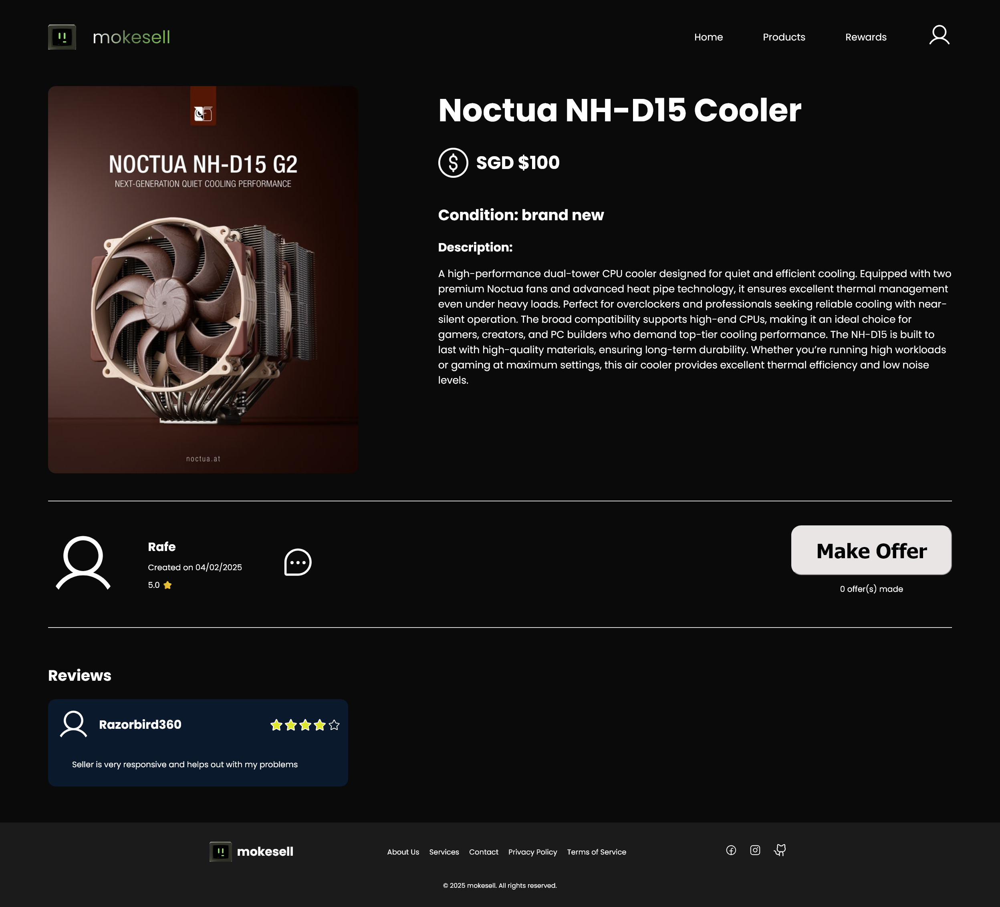
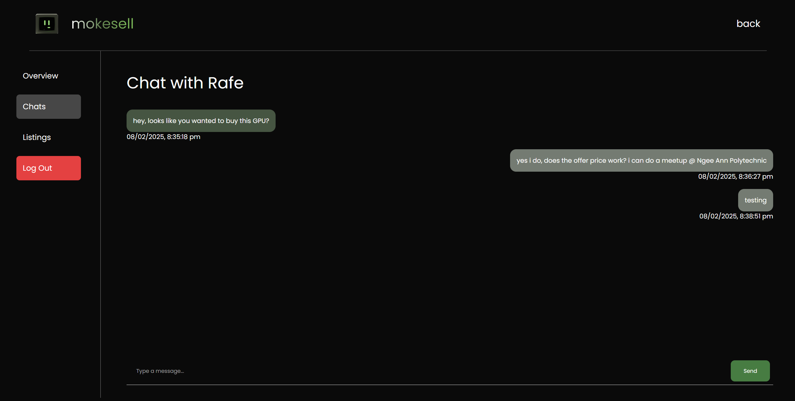

<p align="center">
  
</p>

# FED-Assg2-Mokesell

A repository for Ngee Ann Poly's Front End Development assignment 2 module. Project is based on a consumer-consumer PC ecommerce platform.

# The Team

Ooi Jing Shun

Rafe Chan Rui An

Ng Sao Keat

### **IMPORTANT**

#### **How to Run the Project**

1. Ensure that **Node.js** is installed on your system. You can download it from [Node.js Official Website](https://nodejs.org/).
2. Navigate to the root directory of the project in your terminal and run the following command to install the required dependencies from `package.json`:

   ```bash
   npm install
   ```

3. Firebase Backend Credentials:

- Firebase credentials are **not included** in the GitHub repository.
- For lecturers marking the project, these credentials are already provided in the folder submitted through the school portal.
- Thus, no additional configuration is required on your part; the project should run automatically with the provided setup.

4. To start the development server

- Run the following command in the terminal

  ```bash
  npx vite
  ```

  OR

  ```bash
  npm run dev
  ```

<p align="center">
  
</p>

### Website live at:

https://fisherman-23.github.io/FED-Assg2-Mokesell

### Github Repo Link

https://github.com/fisherman-23/FED-Assg2-Mokesell

### Figma Wireframe

https://www.figma.com/design/rhxwZToh101cMxgyN2sSQk/FED-Assignment-2?node-id=0-1&t=OWnwjZXRIVsDOYTu-1

## Overview of Idea

Mokesell is an online consumer-to-consumer e-commerce platform dedicated to buying and selling second-hand personal computing hardware, including PCs, components like CPUs and GPUs, and display monitors.

### Overall Goal

- **Fully Functional E-Commerce Platform:** A robust and error-free website featuring a seamless integration of frontend and backend systems. The platform includes a responsive and user-friendly interface, a reliable backend to handle data processing, and comprehensive error handling to ensure smooth operation and an exceptional user experience.
- **Interactive and Visually Engaging UI:** Leverage Three.js assets, Lottie animations, and thoughtfully crafted CSS and JavaScript animations to create a dynamic, visually appealing interface with seamless, user-friendly interactions.
- **Fast and High-Performance Experience:** Optimize backend processes with image caching and compression to minimize hiccups, leverage the blazing-fast Firebase Firestore database for rapid data access, and implement streamlined API calls for maximum efficiency.
- **Mobile-friendly:** A website that is able to conform to a smaller screen size with the use of media queries and other optimisations, allowing for easy access when on the go, a staple for E-Commerce sites.

### Design Choice

We decided on a primarily black background design, with colorful gradients and rounded elements. We decided to integrate a 3D model on the landing page using Three JS and Lottie animations The primary font choice used is Poppins.

## Roles and Responsibilities

### Ooi Jing Shun (S10266121F)

### Role: Full Stack Developer

**Responsibility**:  
Responsible for setting up the database and authentication system, ensuring seamless connectivity between the backend and the frontend through APIs. Works closely with the team to integrate both functional and design elements, contributing to the website's smooth operation. Additionally, contributes to the design of the website, ensuring a cohesive and intuitive user experience. As a key contributor to the frontend, ensures that the website is responsive and engaging.

**Workscope**:

- **Database & Authentication Setup**:  
  Responsible for configuring the database and implementing authentication, ensuring secure user access and data management. The setup allows for efficient handling of user data and interactions on the platform.

- **API Integration**:  
  In charge of connecting the backend with the frontend via APIs, ensuring smooth communication between the server and the client. This integration enables features such as dynamic product listings, user interactions, and real-time chat updates.

- **Frontend Development**:  
  Contributed significantly to the frontend, ensuring a user-friendly and visually appealing interface. Worked alongside Rafe to incorporate intuitive design elements, including the use of **Lottie animations** progress animations to enhance user engagement as well as an interactive Three JS model.

- **Figma Design**:  
  Worked on the website design, ensuring the frontend aligns with the branding and business requirements. Focused on delivering a responsive, clean, and visually engaging design that supports an exceptional user experience.

- **Performance Optimization**:  
  Implemented image caching and compression to enhance website performance, reducing load times and ensuring that the latest content is served quickly and efficiently.

<hr>

### Rafe Chan Rui An (S10266058G)

### Role: Frontend Developer

**Responsibility**:  
Responsible for developing and implementing the frontend of the website using HTML, CSS, and JavaScript. Focused on creating engaging user interfaces for the product listings, detail pages, search functionality, and other interactive elements. Also contributed to optimizing the website for mobile devices, ensuring it provides a seamless and responsive experience across different screen sizes. Worked closely with the design team to bring the visual aspects of the website to life.

**Workscope**:

- **Product Listings and Details Page**:  
  Developed the pages that display product information, including the layout and design of the product listings. Focused on creating an intuitive and visually appealing way to display product details, helping users easily navigate through available items.

- **Search and Filter Functionality**:  
  Implemented powerful search and filter options, allowing users to efficiently find products based on specific criteria. The search functionality was designed for easy use and improved user experience.

- **Memory Game**:  
  Followed a tutorial to develop an interactive memory game and adopted it to fix mokesell context + styling fixes, providing a fun and engaging feature for users. The game adds an entertaining element to the website, encouraging user participation.

- **Mobile Optimization**:  
  Focused on ensuring the website was fully optimized for mobile devices. Applied responsive design techniques to ensure that the site’s layout and functionality adapt to various screen sizes and devices, improving usability and performance on mobile platforms.

- **UI Implementation**:  
  Collaborated with the design team to implement the website’s UI, ensuring a visually engaging, user-friendly layout. Utilized CSS and JavaScript to bring the design elements to life and maintain consistent branding and aesthetics throughout the site.

<hr>

### Ng Sao Keat (S10270586)

### Role: Frontend Developer (Rewards Page)

**Responsibility**:  
Focused on developing and optimizing the rewards page, ensuring it was both functional and visually engaging. Worked on mobile optimization for the page, ensuring that users could easily access and navigate the rewards features on smaller screens. Collaborated with the team to ensure a consistent user experience.

**Workscope**:

- **Rewards Page Development**:  
  Developed the rewards page, where users can view and redeem their rewards. Focused on creating an intuitive layout that encourages engagement and enhances the overall user experience. Ensured that the rewards page aligned with the overall branding, providing a seamless look and feel for users. Worked on maintaining visual consistency with the rest of the website’s design.

## Features Summary:

1. **User Account Management**
2. **Product Listing and Offering Management**
   1. Allows sellers to upload product images, set prices, and other basic information to list products.
   2. Bump feature for sellers to increase product visibility.
   3. Ranking algorithm: `rank = base_rank - (days_since_creation * decay_factor)`
   4. Allows buyers to like a product.
   5. Allows buyers to chat with sellers and discuss details.
   6. Allows buyers to formally make offers.
   7. Allows sellers to accept offers.
3. **Optimisied Expereince**
   1. Fast performance w image caching & compression
   2. Mobile responsive
4. **Powerful Product Search and Filter**
5. **Chat with Seller/Buyer**
6. **Gamification Features**
7. **Unique User Interface using Three.js and Lottie Animations**

## Mokesell Web Pages

### Home Page:


### Product Page:


### Product Details Page:



### Chat Page:



## Technology Usage

### Firebase

- **Purpose:** Used for database management and user authentication.
- **Impact:** Provides reliable, scalable backend services, ensuring secure user authentication and efficient data storage and retrieval.

### Compressor JS

- **Purpose:** A JavaScript library used for image compression.
- **Impact:** Reduces image sizes, improving website performance and loading times.

### Three.js

- **Purpose:** A JavaScript library for creating 3D graphics in the browser.
- **Impact:** Enables rich, interactive 3D visualizations, enhancing the user experience with dynamic and engaging content.

### UUID

- **Purpose:** Generates unique identifiers for objects or data.
- **Impact:** Ensures that each entity within the application has a unique identifier, facilitating better data management and preventing conflicts.

### Vite

- **Purpose:** A modern, fast development server and build tool.
- **Impact:** Speeds up development with quick builds and hot module replacement, enhancing the developer experience and reducing build times.

### Lottie

- **Purpose:** A library for rendering animations in JSON format.
- **Impact:** Enables smooth, lightweight animations that improve the overall visual appeal of the website without sacrificing performance.

### Image Caching and Query Parameters

- **Purpose:** Caches images for faster retrieval and uses query parameters to fetch listing information and control image versions or changes.
- **Impact:** Enhances website performance by reducing image load times and ensuring that the most up-to-date listing information and images are served to users efficiently.

### Vanila Tilt JS

- **Purpose:** A lightweight JavaScript library used to create interactive 3D tilt effects on DOM elements. It allows elements to respond to mouse movement, adding depth and interactivity to the website.
- **Impact:** Enhances the visual appeal and user engagement of the website by providing subtle, smooth animations that make interactions feel more dynamic and immersive.

### dotenv

- **Purpose:** Loads environment variables from a `.env` file into `process.env`.
- **Impact:** Secures sensitive data like API keys and configurations, making the project more manageable and secure across different environments.

### HTML, CSS, JS

- **Purpose:** Core technologies for building and styling web pages and adding interactivity.
- **Impact:** Provides the foundational structure, design, and functionality for the website, contributing to a seamless user experience and responsive design.

## Credits

- Tutorials
  - [Memory Card Game](https://dev.to/javascriptacademy/creating-a-memory-card-game-with-html-css-and-javascript-57g1)
  - [CSS Progressive Blur](https://codepen.io/silas/pen/rNYqZoz)
- Resources
  - [Firebase Documentation](https://firebase.google.com/docs)
  - [Query Parameters](https://www.branch.io/glossary/query-parameters/#:~:text=What%20are%20query%20parameters%3F,web%20server%20when%20making%20requests.)
  - [Mesh Gradient Generator](https://www.csshero.org/mesher/)
- Assets
  - [Retro Computer 3D Model](https://www.blenderkit.com/get-blenderkit/0d42296d-6f1b-4ab1-9f06-a3dbf0b366b4/)
  - [Figma Phosphor Icon Pack](https://www.figma.com/community/file/903830135544202908/phosphor-icons)

### Usage of Generative AI

We use Generative AI tools like ChatGPT, DeepSeek & Microsoft Copilot to assist us in the development of this assignment. These tools have been employed to help with various tasks, including generating ideas, improving code quality, drafting documentation, and refining our overall project. While the AI has been instrumental in enhancing the efficiency of our work, we acknowledge that the final output, analysis, and conclusions are the result of our individual efforts and critical thinking.

1. ThreeJS model mouse tracking: ChatGPT was used to help with implementation of tracking the mouse movement and moving the 3D model accordingly


2. Product details data: ChatGPT was used to generate 14 product details in the form of a specified JSON format for testing of your application

